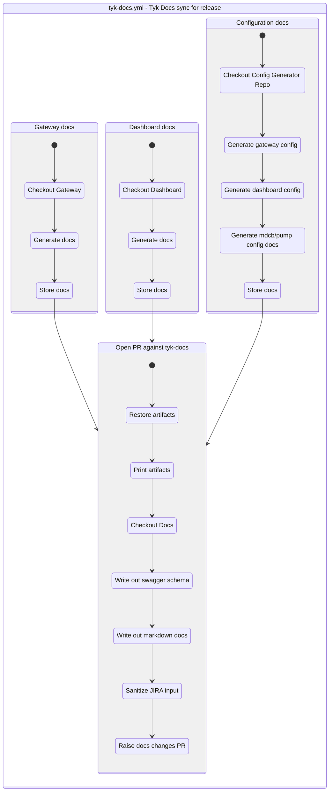

# GitHub Actions Vizualizer

The tool, if ran in a github actions folder, reads in the `*.{yml,yaml}`
files and produces a mermaidjs diagram for each workflow.

To install:

`go install github.com/TykTechnologies/exp/cmd/github-actions-viz@main`

Flags:

- `-i <folder>` - input folder (defaults to .),
- `--format <md|mermaid>` - define the output format,
- `-w` writes out files to disk.

To use:

- GitHub PRs / Markdown: https://github.blog/2022-02-14-include-diagrams-markdown-files-mermaid/
- Hugo docs / Markdown: https://discourse.gohugo.io/t/correct-way-to-embed-mermaid-js/43491/3
- Live editor: https://mermaid.live/

## Example

## Other/misc

- Docker Compose variant: https://github.com/pmsipilot/docker-compose-viz
- This project uses nektos/act - to read the github actions with their data model
