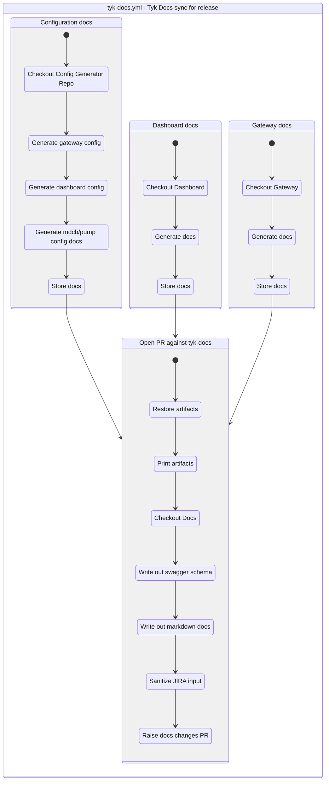

# GitHub Actions Visualizer

The tool, if ran in a github actions folder, reads in the `*.{yml,yaml}`
files and produces a mermaidjs diagram for each workflow.

To install:

`go install github.com/TykTechnologies/exp/cmd/github-actions-viz@main`

Flags:

- `-i <folder>` - input folder (defaults to .),
- `--format <md|mermaid>` - define the output format,
- `-w` writes out files to disk.

The files written out are `action.yml.md` and `action.yml.mermaid`
respectively. The .mermaid file could be used by further tooling. See
references as the end of readme.

## Example

## Other/misc

- [Mermaid online editor](https://mermaid.live)
- [Mermaid CLI](https://github.com/mermaid-js/mermaid-cli) - Cli tooling with markdown/svg rendering
- [Docker Compose graph visualization](https://github.com/pmsipilot/docker-compose-viz)
- [GitHub PRs / Markdown](https://github.blog/2022-02-14-include-diagrams-markdown-files-mermaid/)
- [Hugo docs / Markdown](https://discourse.gohugo.io/t/correct-way-to-embed-mermaid-js/43491/3)

## Status

- Mostly responds well to a filled out `name` in github actions,
- Resolves `needs` at least on the root level correctly

Fidelity notes:

- It may have problem with deeper nesting correctness (fidelity)
- It doesn't render/note dependent workflows [stackoverflow, workflow_run](https://stackoverflow.com/questions/58457140/dependencies-between-workflows-on-github-actions)
- It doesn't render dependent steps with `id` and GITHUB_OUTPUT's

This project uses [nektos/act
pkg/model](https://pkg.go.dev/github.com/nektos/act@v0.2.49/pkg/model#Workflow)
to read the github actions workflow files.

## Usage

Used for [/exp/docs/github-actions](https://github.com/TykTechnologies/exp/tree/main/docs/github-actions).