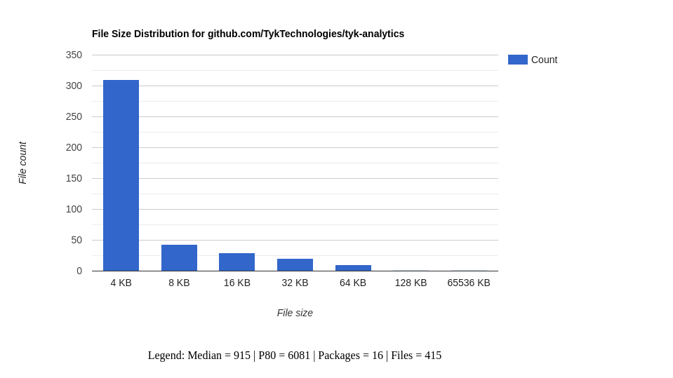

# go-ddd-stats

The tool prints filesystem stats for a go project. It requires `go mod
list` to detect the number of packages and the package name.

Options: `--json`, `--stats`.

Example:

```
# go-ddd-stats --stats --json | jq .
{
  "Package": "github.com/TykTechnologies/tyk",
  "Sizes": [
    {
      "Size": "<= 4 KB",
      "Count": 183
    },
    {
      "Size": "<= 8 KB",
      "Count": 94
    },
    {
      "Size": "<= 16 KB",
      "Count": 70
    },
    {
      "Size": "<= 32 KB",
      "Count": 28
    },
    {
      "Size": "<= 64 KB",
      "Count": 19
    },
    {
      "Size": "<= 128 KB",
      "Count": 3
    }
  ],
  "Median": 4656,
  "P80": 11109,
  "Packages": 48,
  "Files": 397
}
```

Check out `chart.html` for a visualization of the data.



