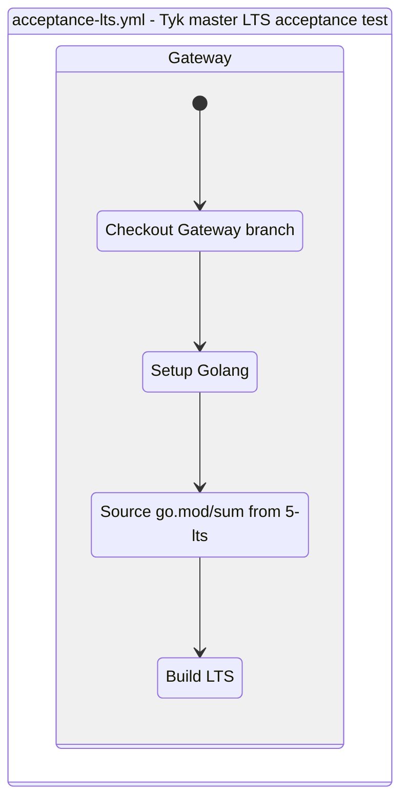

# Tyk master LTS acceptance test

```mermaid
stateDiagram-v2
    workflow : acceptance-lts.yml - Tyk master LTS acceptance test
    state workflow {
        gateway: Gateway
        state gateway {
            [*] --> step0gateway
            step0gateway : Checkout Gateway branch
            step0gateway --> step1gateway
            step1gateway : Setup Golang
            step1gateway --> step2gateway
            step2gateway : Source go.mod/sum from 5-lts
            step2gateway --> step3gateway
            step3gateway : Build LTS
        }
    }
```
