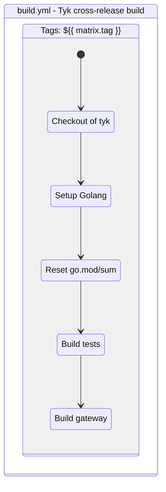

# Tyk cross-release build

```mermaid
stateDiagram-v2
    workflow : build.yml - Tyk cross-release build
    state workflow {
        test_builds: Tags: ${{ matrix.tag }}
        state test_builds {
            [*] --> step0test_builds
            step0test_builds : Checkout of tyk
            step0test_builds --> step1test_builds
            step1test_builds : Setup Golang
            step1test_builds --> step2test_builds
            step2test_builds : Reset go.mod/sum
            step2test_builds --> step3test_builds
            step3test_builds : Build tests
            step3test_builds --> step4test_builds
            step4test_builds : Build gateway
        }
    }
```
