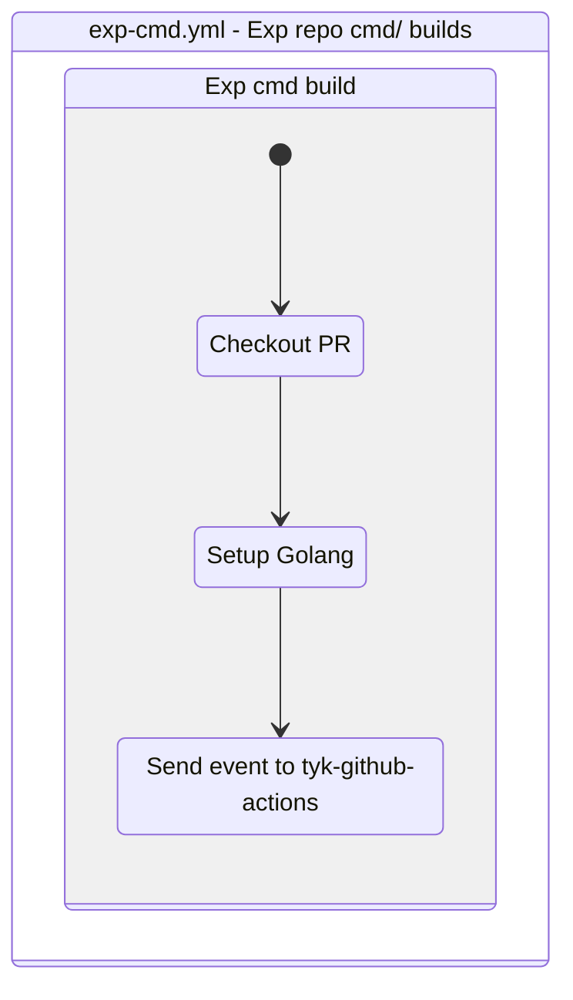

# Exp repo cmd/ builds

```mermaid
stateDiagram-v2
    workflow : exp-cmd.yml - Exp repo cmd/ builds
    state workflow {
        exp_cmd_build: Exp cmd build
        state exp_cmd_build {
            [*] --> step0exp_cmd_build
            step0exp_cmd_build : Checkout PR
            step0exp_cmd_build --> step1exp_cmd_build
            step1exp_cmd_build : Setup Golang
            step1exp_cmd_build --> step4exp_cmd_build
            step4exp_cmd_build : Send event to tyk-github-actions
        }
    }
```
