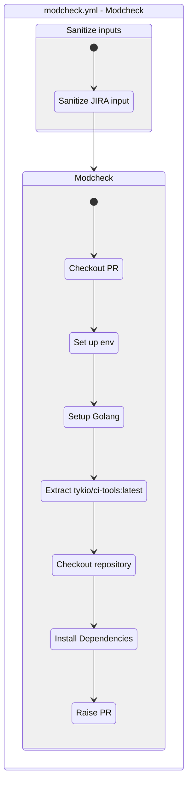

# Modcheck

```mermaid
stateDiagram-v2
    workflow : modcheck.yml - Modcheck
    state workflow {
        sanitize: Sanitize inputs
        state sanitize {
            [*] --> step0sanitize
            step0sanitize : Sanitize JIRA input
            step0sanitize --> modcheck
        }

        modcheck: Modcheck
        state modcheck {
            [*] --> step0modcheck
            step0modcheck : Checkout PR
            step0modcheck --> step1modcheck
            step1modcheck : Set up env
            step1modcheck --> step2modcheck
            step2modcheck : Setup Golang
            step2modcheck --> step3modcheck
            step3modcheck : Extract tykio/ci-tools:latest
            step3modcheck --> step5modcheck
            step5modcheck : Checkout repository
            step5modcheck --> step6modcheck
            step6modcheck : Install Dependencies
            step6modcheck --> step11modcheck
            step11modcheck : Raise PR
        }
    }
```
