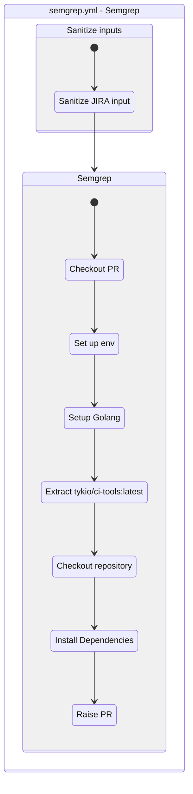

# Semgrep

```mermaid
stateDiagram-v2
    workflow : semgrep.yml - Semgrep
    state workflow {
        sanitize: Sanitize inputs
        state sanitize {
            [*] --> step0sanitize
            step0sanitize : Sanitize JIRA input
            step0sanitize --> semgrep
        }

        semgrep: Semgrep
        state semgrep {
            [*] --> step0semgrep
            step0semgrep : Checkout PR
            step0semgrep --> step1semgrep
            step1semgrep : Set up env
            step1semgrep --> step2semgrep
            step2semgrep : Setup Golang
            step2semgrep --> step3semgrep
            step3semgrep : Extract tykio/ci-tools:latest
            step3semgrep --> step4semgrep
            step4semgrep : Checkout repository
            step4semgrep --> step5semgrep
            step5semgrep : Install Dependencies
            step5semgrep --> step9semgrep
            step9semgrep : Raise PR
        }
    }
```
