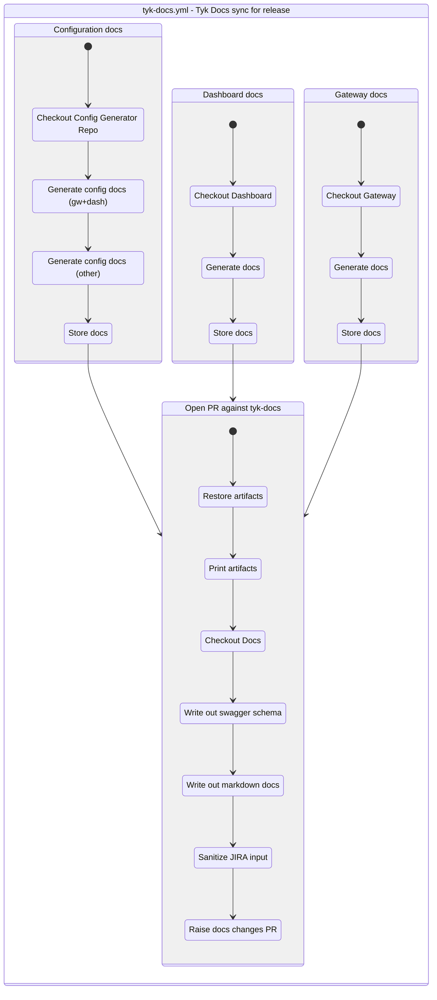

# Tyk Docs sync for release

```mermaid
stateDiagram-v2
    workflow : tyk-docs.yml - Tyk Docs sync for release
    state workflow {
        configs: Configuration docs
        state configs {
            [*] --> step0configs
            step0configs : Checkout Config Generator Repo
            step0configs --> step1configs
            step1configs : Generate config docs (gw+dash)
            step1configs --> step2configs
            step2configs : Generate config docs (other)
            step2configs --> step3configs
            step3configs : Store docs
            step3configs --> finish
        }

        dashboard: Dashboard docs
        state dashboard {
            [*] --> step0dashboard
            step0dashboard : Checkout Dashboard
            step0dashboard --> step1dashboard
            step1dashboard : Generate docs
            step1dashboard --> step2dashboard
            step2dashboard : Store docs
            step2dashboard --> finish
        }

        gateway: Gateway docs
        state gateway {
            [*] --> step0gateway
            step0gateway : Checkout Gateway
            step0gateway --> step1gateway
            step1gateway : Generate docs
            step1gateway --> step2gateway
            step2gateway : Store docs
            step2gateway --> finish
        }

        finish: Open PR against tyk-docs
        state finish {
            [*] --> step0finish
            step0finish : Restore artifacts
            step0finish --> step1finish
            step1finish : Print artifacts
            step1finish --> step2finish
            step2finish : Checkout Docs
            step2finish --> step3finish
            step3finish : Write out swagger schema
            step3finish --> step4finish
            step4finish : Write out markdown docs
            step4finish --> step5finish
            step5finish : Sanitize JIRA input
            step5finish --> step6finish
            step6finish : Raise docs changes PR
        }
    }
```
