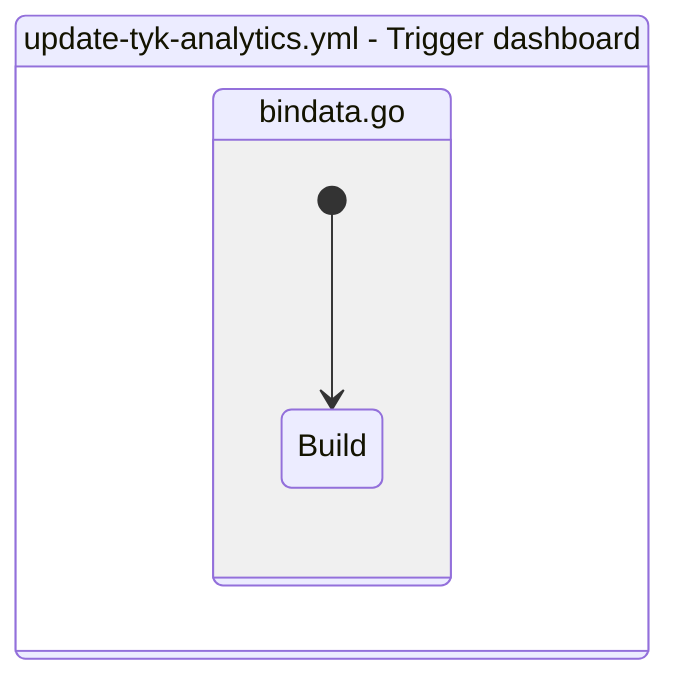

# Trigger dashboard

```mermaid
stateDiagram-v2
    workflow : update-tyk-analytics.yml - Trigger dashboard
    state workflow {
        bindata: bindata.go
        state bindata {
            [*] --> step3bindata
            step3bindata : Build
        }
    }
```
