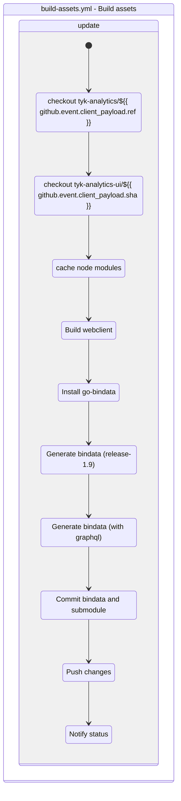

# Build assets

```mermaid
stateDiagram-v2
    workflow : build-assets.yml - Build assets
    state workflow {
        update: update
        state update {
            [*] --> step0update
            step0update : checkout tyk-analytics/${{ github.event.client_payload.ref }}
            step0update --> step1update
            step1update : checkout tyk-analytics-ui/${{ github.event.client_payload.sha }}
            step1update --> step4update
            step4update : cache node modules
            step4update --> step5update
            step5update : Build webclient
            step5update --> step6update
            step6update : Install go-bindata
            step6update --> step7update
            step7update : Generate bindata (release-1.9)
            step7update --> step8update
            step8update : Generate bindata (with graphql)
            step8update --> step9update
            step9update : Commit bindata and submodule
            step9update --> step11update
            step11update : Push changes
            step11update --> step12update
            step12update : Notify status
        }
    }
```
