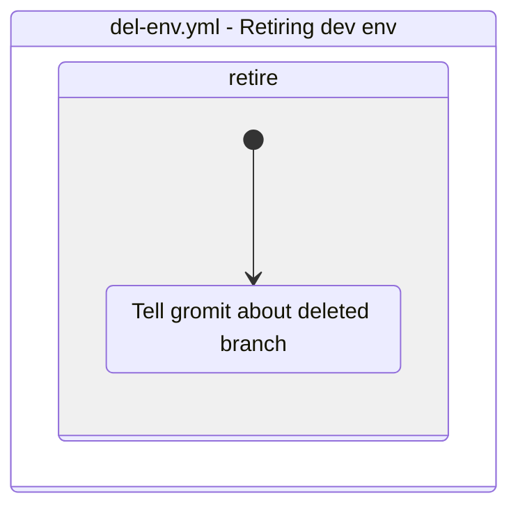

# Retiring dev env

```mermaid
stateDiagram-v2
    workflow : del-env.yml - Retiring dev env
    state workflow {
        retire: 
        state retire {
            [*] --> step0retire
            step0retire : Tell gromit about deleted branch
        }
    }

```
