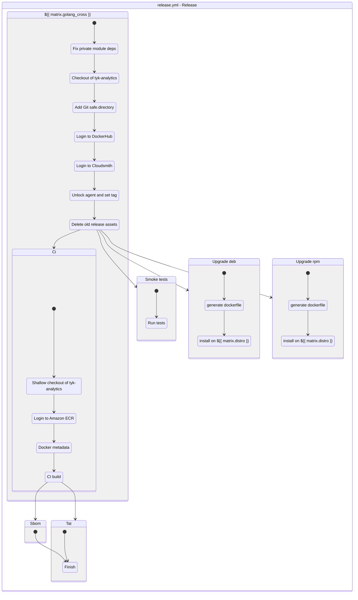

# Release

```mermaid
stateDiagram-v2
    workflow : release.yml - Release
    state workflow {
        ci: Ci
        state ci {
            [*] --> step0ci
            step0ci : Shallow checkout of tyk-analytics
            step0ci --> step2ci
            step2ci : Login to Amazon ECR
            step2ci --> step4ci
            step4ci : Docker metadata
            step4ci --> step7ci
            step7ci : CI build
            step7ci --> sbom
            step7ci --> tat
        }

        goreleaser: ${{ matrix.golang_cross }}
        state goreleaser {
            [*] --> step0goreleaser
            step0goreleaser : Fix private module deps
            step0goreleaser --> step1goreleaser
            step1goreleaser : Checkout of tyk-analytics
            step1goreleaser --> step2goreleaser
            step2goreleaser : Add Git safe.directory
            step2goreleaser --> step5goreleaser
            step5goreleaser : Login to DockerHub
            step5goreleaser --> step6goreleaser
            step6goreleaser : Login to Cloudsmith
            step6goreleaser --> step7goreleaser
            step7goreleaser : Unlock agent and set tag
            step7goreleaser --> step8goreleaser
            step8goreleaser : Delete old release assets
            step8goreleaser --> ci
            step8goreleaser --> smoke_tests
            step8goreleaser --> upgrade_deb
            step8goreleaser --> upgrade_rpm
        }

        sbom: Sbom
        state sbom {
            [*] --> Finish
        }

        smoke_tests: Smoke tests
        state smoke_tests {
            [*] --> step1smoke_tests
            step1smoke_tests : Run tests
        }

        tat: Tat
        state tat {
            [*] --> Finish
        }

        upgrade_deb: Upgrade deb
        state upgrade_deb {
            [*] --> step4upgrade_deb
            step4upgrade_deb : generate dockerfile
            step4upgrade_deb --> step5upgrade_deb
            step5upgrade_deb : install on ${{ matrix.distro }}
        }

        upgrade_rpm: Upgrade rpm
        state upgrade_rpm {
            [*] --> step3upgrade_rpm
            step3upgrade_rpm : generate dockerfile
            step3upgrade_rpm --> step4upgrade_rpm
            step4upgrade_rpm : install on ${{ matrix.distro }}
        }
    }
```
