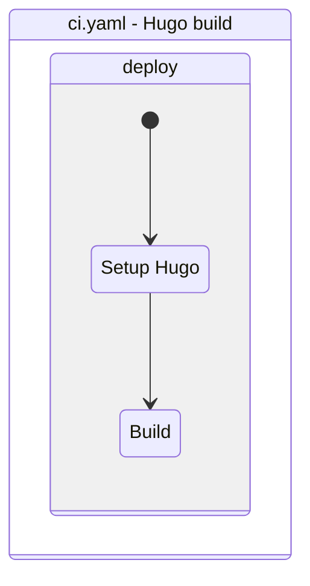

# Hugo build

```mermaid
stateDiagram-v2
    workflow : ci.yaml - Hugo build
    state workflow {
        deploy: deploy
        state deploy {
            [*] --> step1deploy
            step1deploy : Setup Hugo
            step1deploy --> step2deploy
            step2deploy : Build
        }
    }
```
