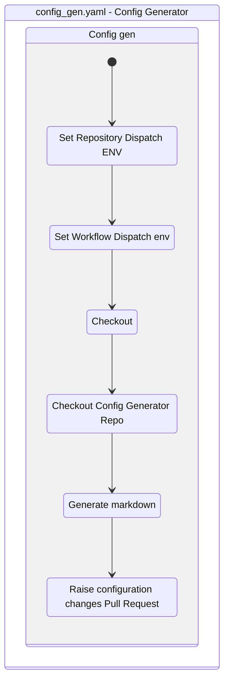

# Config Generator

```mermaid
stateDiagram-v2
    workflow : config_gen.yaml - Config Generator
    state workflow {
        config_gen: Config gen
        state config_gen {
            [*] --> step0config_gen
            step0config_gen : Set Repository Dispatch ENV
            step0config_gen --> step1config_gen
            step1config_gen : Set Workflow Dispatch  env
            step1config_gen --> step2config_gen
            step2config_gen : Checkout
            step2config_gen --> step3config_gen
            step3config_gen : Checkout Config Generator Repo
            step3config_gen --> step4config_gen
            step4config_gen : Generate markdown
            step4config_gen --> step5config_gen
            step5config_gen : Raise configuration changes Pull Request
        }
    }
```
