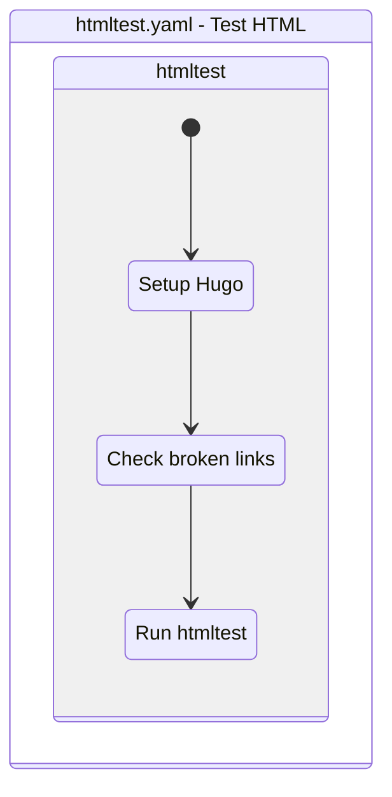

# Test HTML

```mermaid
stateDiagram-v2
    workflow : htmltest.yaml - Test HTML
    state workflow {
        htmltest: htmltest
        state htmltest {
            [*] --> step0htmltest
            step0htmltest : Setup Hugo
            step0htmltest --> step2htmltest
            step2htmltest : Check broken links
            step2htmltest --> step3htmltest
            step3htmltest : Run htmltest
        }
    }
```
