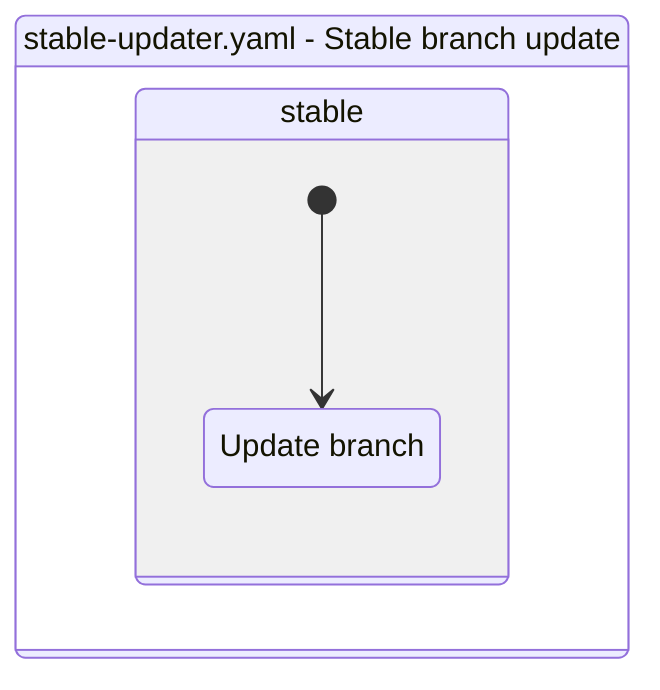

# Stable branch update

```mermaid
stateDiagram-v2
    workflow : stable-updater.yaml - Stable branch update
    state workflow {
        stable: stable
        state stable {
            [*] --> step1stable
            step1stable : Update branch
        }
    }
```
