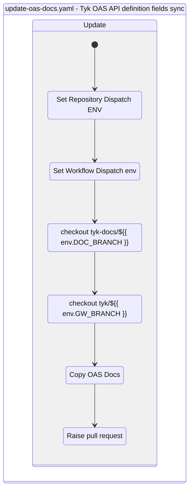

# Tyk OAS API definition fields sync

```mermaid
stateDiagram-v2
    workflow : update-oas-docs.yaml - Tyk OAS API definition fields sync
    state workflow {
        update: Update
        state update {
            [*] --> step0update
            step0update : Set Repository Dispatch ENV
            step0update --> step1update
            step1update : Set Workflow Dispatch  env
            step1update --> step2update
            step2update : checkout tyk-docs/${{ env.DOC_BRANCH }}
            step2update --> step3update
            step3update : checkout tyk/${{ env.GW_BRANCH }}
            step3update --> step4update
            step4update : Copy OAS Docs
            step4update --> step5update
            step5update : Raise pull request
        }
    }
```
