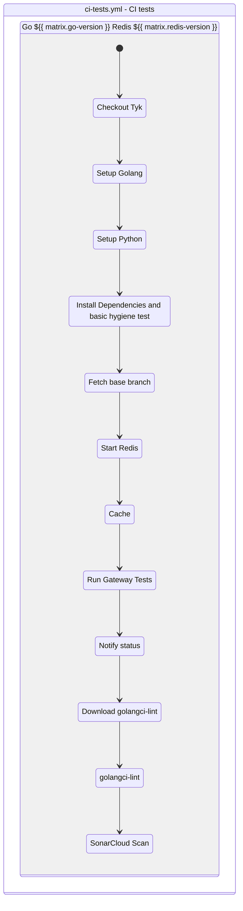

# CI tests

```mermaid
stateDiagram-v2
    workflow : ci-tests.yml - CI tests
    state workflow {
        test: Go ${{ matrix.go-version }} Redis ${{ matrix.redis-version }}
        state test {
            [*] --> step0test
            step0test : Checkout Tyk
            step0test --> step1test
            step1test : Setup Golang
            step1test --> step2test
            step2test : Setup Python
            step2test --> step3test
            step3test : Install Dependencies and basic hygiene test
            step3test --> step4test
            step4test : Fetch base branch
            step4test --> step5test
            step5test : Start Redis
            step5test --> step6test
            step6test : Cache
            step6test --> step7test
            step7test : Run Gateway Tests
            step7test --> step8test
            step8test : Notify status
            step8test --> step9test
            step9test : Download golangci-lint
            step9test --> step10test
            step10test : golangci-lint
            step10test --> step11test
            step11test : SonarCloud Scan
        }
    }
```
