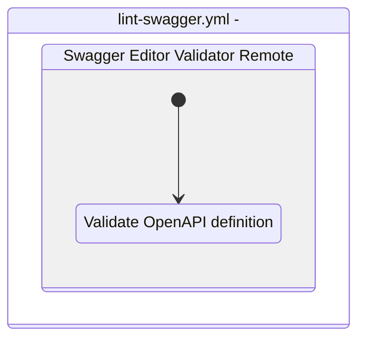

# 

```mermaid
stateDiagram-v2
    workflow : lint-swagger.yml - 
    state workflow {
        test_swagger_editor_validator_remote: Swagger Editor Validator Remote
        state test_swagger_editor_validator_remote {
            [*] --> step1test_swagger_editor_validator_remote
            step1test_swagger_editor_validator_remote : Validate OpenAPI definition
        }
    }
```
