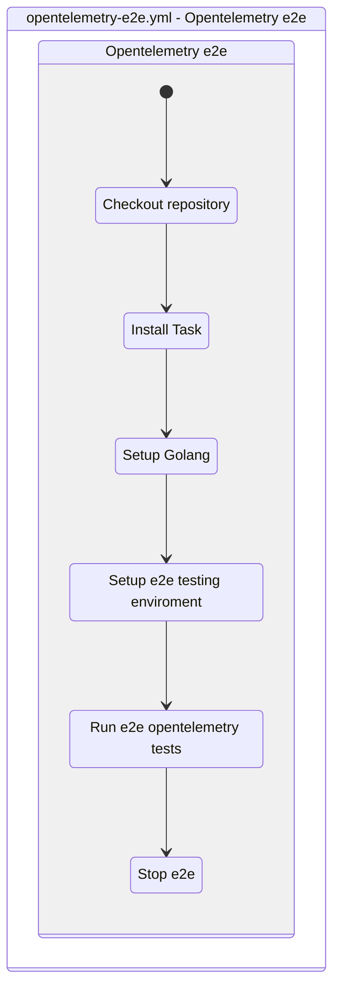

# Opentelemetry e2e

```mermaid
stateDiagram-v2
    workflow : opentelemetry-e2e.yml - Opentelemetry e2e
    state workflow {
        e2e: Opentelemetry e2e
        state e2e {
            [*] --> step0e2e
            step0e2e : Checkout repository
            step0e2e --> step1e2e
            step1e2e : Install Task
            step1e2e --> step2e2e
            step2e2e : Setup Golang
            step2e2e --> step3e2e
            step3e2e : Setup e2e testing enviroment
            step3e2e --> step4e2e
            step4e2e : Run e2e opentelemetry tests
            step4e2e --> step5e2e
            step5e2e : Stop e2e
        }
    }

```
