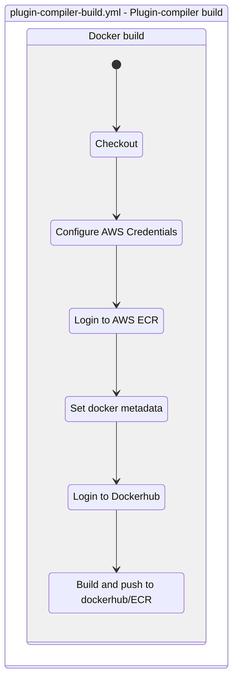

# Plugin-compiler build

```mermaid
stateDiagram-v2
    workflow : plugin-compiler-build.yml - Plugin-compiler build
    state workflow {
        docker_build: Docker build
        state docker_build {
            [*] --> step0docker_build
            step0docker_build : Checkout
            step0docker_build --> step1docker_build
            step1docker_build : Configure AWS Credentials
            step1docker_build --> step2docker_build
            step2docker_build : Login to AWS ECR
            step2docker_build --> step3docker_build
            step3docker_build : Set docker metadata
            step3docker_build --> step4docker_build
            step4docker_build : Login to Dockerhub
            step4docker_build --> step5docker_build
            step5docker_build : Build and push to dockerhub/ECR
        }
    }
```
