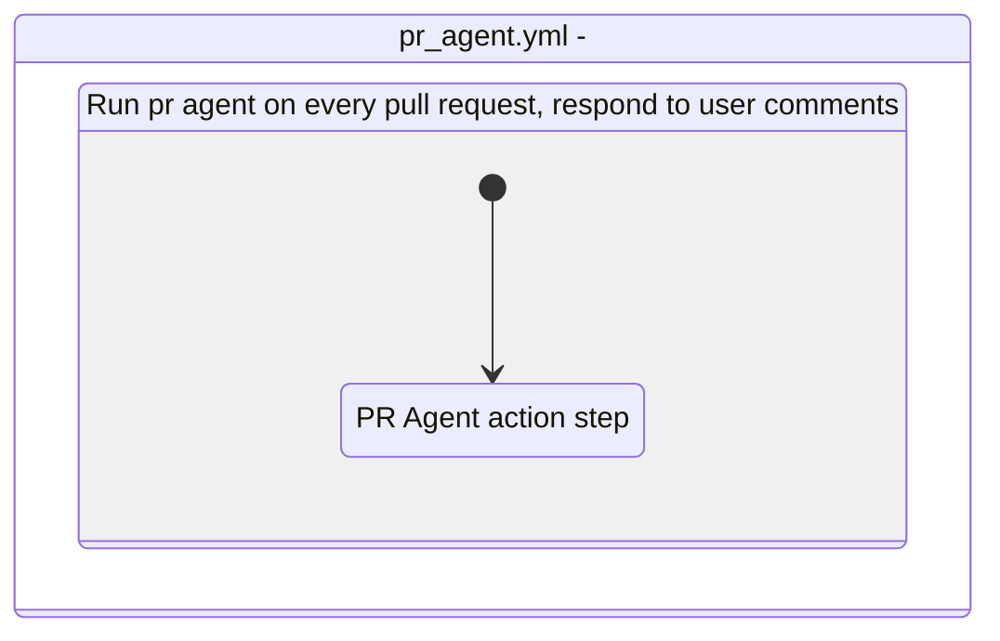

# 

```mermaid
stateDiagram-v2
    workflow : pr_agent.yml - 
    state workflow {
        pr_agent_job: Run pr agent on every pull request, respond to user comments
        state pr_agent_job {
            [*] --> step0pr_agent_job
            step0pr_agent_job : PR Agent action step
        }
    }
```
