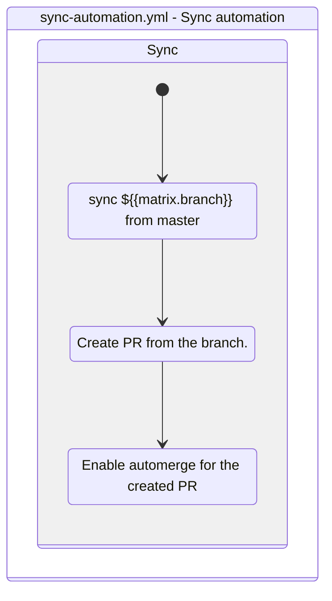

# Sync automation

```mermaid
stateDiagram-v2
    workflow : sync-automation.yml - Sync automation
    state workflow {
        sync: Sync
        state sync {
            [*] --> step1sync
            step1sync : sync ${{matrix.branch}} from master
            step1sync --> step2sync
            step2sync : Create PR from the branch.
            step2sync --> step3sync
            step3sync : Enable automerge for the created PR
        }
    }
```
