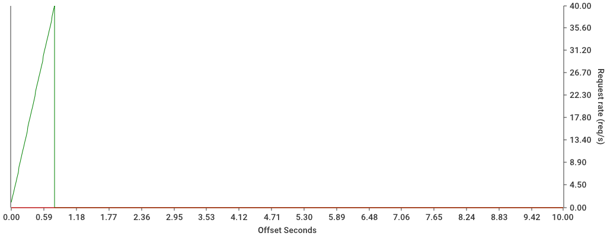

# Redis rate limit behaviour

## Redis details

| Rate limiter | Redis keys used | Commands | Reads | Writes |
| --- | --- | --- | --- | --- |
| Fixed window | `rate-limit-f910d092/1715603948000000000` | 1171 | 676 | 1308 |
| RRL - Redis rolling rate limit | `rate-limit-f910d092` | 3167 | 672 | 1303 |
| RRL + Sentinel | `rate-limit-f910d092`, `rate-limit-f910d092.BLOCKED` | 4131 | 1636 | 3241 |
| DRL | None | 194 | 199 | 383 |

- Fixed window uses 2 commands (incr, pexpire) and only one simple key=value record,
- RRL uses 4 commands (zremrange, zcard, zadd, expire) in a transaction, manages a list of records,
- Sentinel adds +1 get command for usual RL traffic to get the sentinel key, +1 when blocking to write the sentinel key (6+transaction)
- DRL does not use redis for rate limiting, the commands are general redis traffic.

The complexity of RRL solutions is that it also stores a larger amount of data.
Sentinel should be discouraged or even removed, due to excessive client traffic.

Memory usage on the RRL key is:

- 3 items = 177b, 59 bytes per value,
- 15 items = 585b, 39 bytes per value,

Memory usage is not linear, but a high number of requests within a `per` window
will require a substantially large resource allocation to process rate limit commands.
The commands in use have large big-O complexity, so the main impact seems to be CPU
oriented for ZRANGE/ZCARD/ZADD commands and network oriented (number of commands).

## Request latencies

| Rate Limiter  | Count | Mean | P50   | P95   | P99   | P999  | P9999 | P99999 |
| ------------- | ----- | ---- | ----- | ----- | ----- | ----- | ----- | ------- |
| DRL           | 4997  | 231µs | 200µs | 400µs | 400µs | 800µs | 8.2ms | 8.2ms   |
| RRL           | 5000  | 391µs | 400µs | 600µs | 700µs | 1.2ms | 2ms   | 2.3ms   |
| Sentinel      | 4997  | 336µs | 300µs | 600µs | 700µs | 1ms   | 4ms   | 4ms     |
| Fixed-window  | 4998  | 346µs | 300µs | 600µs | 600µs | 900µs | 2.5ms | 2.5ms   |

Excluding DRL as it does not use Redis, the Sentinel rate limiter shows
the lowest mean latency at 336µs, indicating it has the fastest average
processing time among the remaining rate limiters.

The Fixed-window rate limiter follows closely with a mean latency of
346µs and a faster 99th percentile latency, and significantly less redis load.

## Fixed window

## Sliding log (sentinel)

## DRL (non-redis)

## RRL (redis rolling rate limiter)

