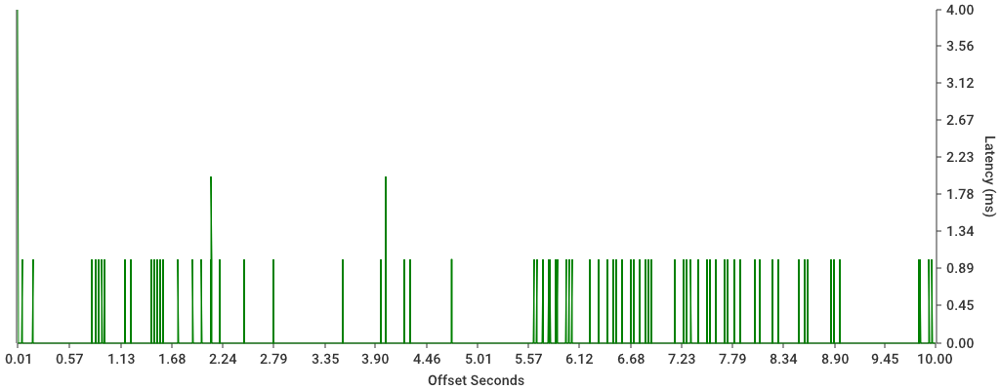
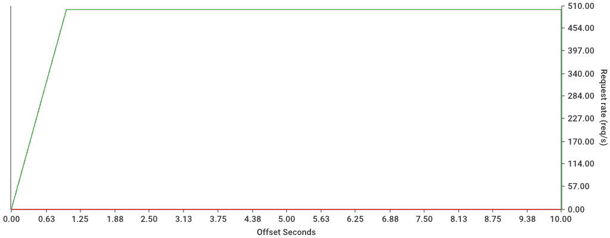
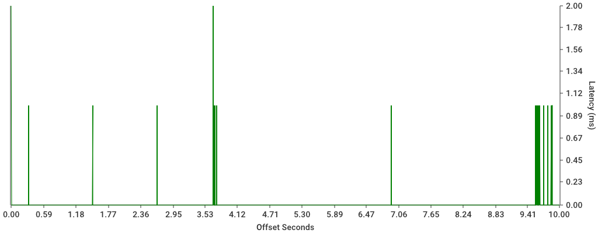
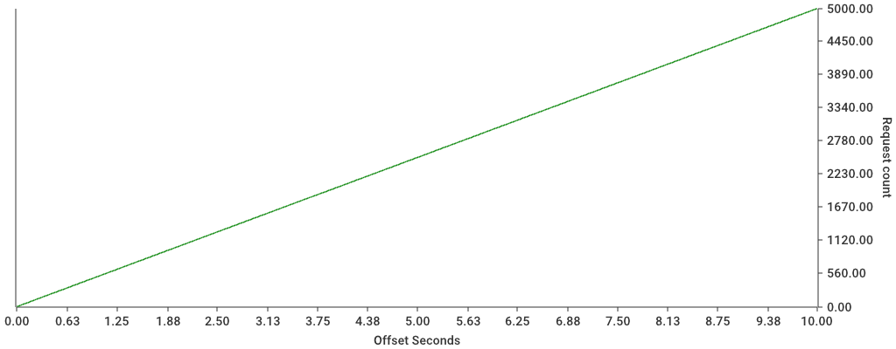
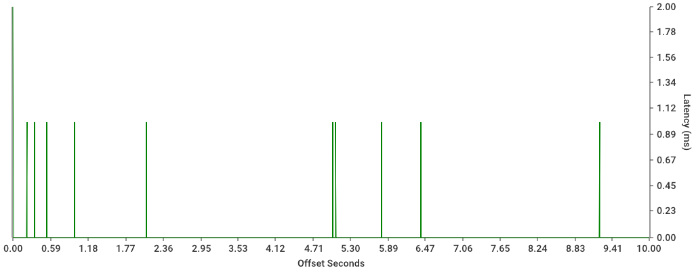
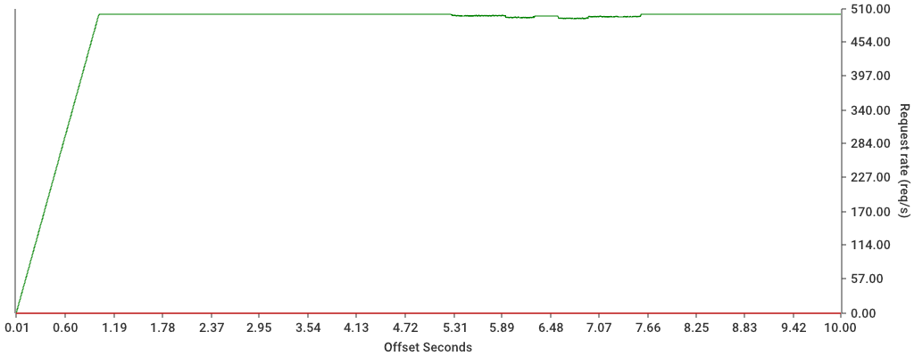
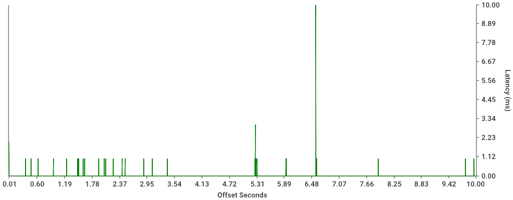
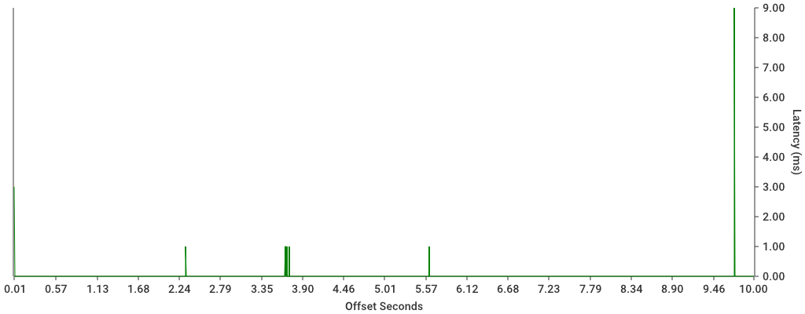
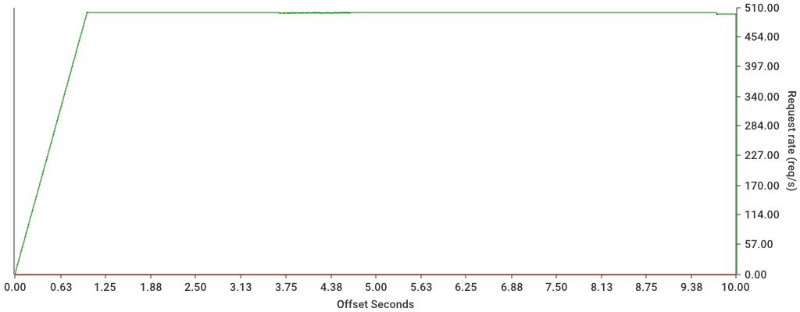

# Redis rate limit behaviour

The following examples configure:

- Rate limiter: A `rate` value of `50000` and `per` value of `1` (`50k requests / second`),
- Request rate: A client request rate of `500 requests / second`,
- Test duration: `10` seconds.

All rate limiters should reach blocking/throttling behaviour.

For each limiter, the following graphs are presented:

- incoming rate
- response latency
- outgoing rate
- outgoing request count

## Leaky bucket

Leaky bucket adds delays when processing requests, ensuring a
configurable input/output rate. The gateway queues the requests for a
time if they are going over the rate limit.

Left to verify:

- if the capacity (rate) is exhausted, it should start blocking requests

## Token bucket

Token bucket counts the available number of requests up to the configured
outgoing rate. It allows `40` requests in a given window. If the capacity
is exceeded and no more tokens are left in the window, it begings to block
requests.

Left to verify:

- If the request rate is higher than configured then the behaviour changes
to spike arrest mode. It lets 1 request through per time window.

## Sliding window

This counts the requests for two windows of 1 second. After the request
limit is exceeded in a window, the behaviour is to block requests until
the rate limit drops below the required level.

This is most similar to our RRL/ Sentinel RRL implementations, but more
efficient as it only requires maintaining two redis keys, rather than a
request log for the window.

## Fixed window

This method counts the number of requests per window and then blocks the
requests if they go over the defined capacity.

The interval for the fixed window is set by the rate limit setting (1
second). As the tests don't exactly line up and start on 00.00 (start of
second), the initial blocking is dependent on when the requests start.

## Sliding log (sentinel)

Sliding log begins to count traffic in the current window and will start
to block traffic if the capacity is exceeded. It will continue to block
traffic as long as the rate is higher than configured.

- If sentinel is configured, it will block traffic until at least `per` duration.
- If sentinel is NOT configured, it will block traffic until request rate drops.

The main difference is just the amount of time requests get blocked.
Blocked requests continue to be counted against the rate limit.

## DRL (non-redis)

This should behave like leaky bucket, however it doesn't seem to be
blocking requests and the throughput is higher than configured, needs
more investigation.